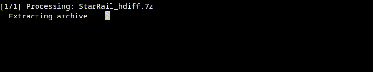

# hdiff-apply
User-friendly updater/patcher for gacha games that doesn't punish you

<p align="center">
    
</p>

## Features
- Support for HDiff and LDiff
- Sequential updates
- Parallelized patching process
- Safe patching: Game files remain unchanged if patching fails

## How to use (easiest way)
1. Download the latest version from [releases](https://github.com/nie4/hdiff-apply/releases)
2. Place `hdiff-apply.exe` in your game installation directory
3. Put your patch archive(s) in the same folder (do not extract)
4. Run `hdiff-apply.exe` and follow the prompts

## CLI usage
```
Usage: hdiff-apply.exe [options]

Options:
  -g, --game-path <DIR>       Game installation directory (default: current working directory)
  -a, --archives-path <DIR>   Directory containing patch archives (default: --game-path)
  -h, --help                  Show this help message

EXAMPLES:
  # Apply patches from current directory
  hdiff-apply

  # Specify game installation path
  hdiff-apply -g "C:\Games\GameName"

  # Patch archives in different directory
  hdiff-apply -g "C:\Games\GameName" -a "D:\Downloads\patches"
```

## Building from Source

### Prerequisites
- [Rust toolchain](https://www.rust-lang.org/tools/install) (nightly)

### Compilation
```bash
git clone https://github.com/nie4/hdiff-apply.git
cd hdiff-apply
cargo build --release
```

## Credits
- [7-Zip](https://7-zip.org/) for file archive utility (`seven-zip/bin/*`)
- [CollapseLauncher/Hi3Helper.Sophon](https://github.com/CollapseLauncher/Hi3Helper.Sophon) for updated sophon proto
- [TwintailTeam/hdiffpatch-rs](https://github.com/TwintailTeam/hdiffpatch-rs) for a rust based patcher

## Issues & Contributions
Found a bug or want to contribute? Please open an issue or pull request on [GitHub](https://github.com/nie4/hdiff-apply).
